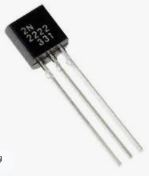

# Project Neptune: Arduino GPS w/ microSD logging and Bluetooth for Nikon D300(S)/D700
This is Project Neptune: an Arduino-based GPS data-logger for Nikon D300, D300S and D700 cameras with USB and Bluetooth connectivity.

  
  

## Why?
I'm an active travel photographer, and use various hardware & software-based GPS solutions to geo-tag my images, all with distinct shortcomings when paired with my ancient (but lovely) Nikon D700. So, I've built a geo-tagging device to meet my own specific needs. (See [Disclaimer](#Disclaimer).)

Leveraging what I've learned from an earlier attempt at a mobile GPS-solution (see [Project Pluto](https://github.com/daifukusensei/arduino-gps-logger)), I've affectionately named this Project Neptune.

## Features
- Mounts to the bottom of a Nikon D300(S)/D700
- Powered directly from camera independent of it being on or off
- Connects to camera via Mini-USB to 10-pin cable, for geo-tagging of captured images directly into EXIF metadata
- Logging of co-ordinates to microSD card at 2-second intervals
- Waypoint-marking of points of interest
- Bluetooth pairing with mobile phone or Serial Port Profile (SPP)NMEA 0183-compatible device/DSLR with PIN/passkey 0000
- LEDs to indicate satellite and Bluetooth fix, and microSD card activity
- Individual features (microSD logging, Bluetooth and LEDs) may be toggled on or off, with settings retained across power-cycles

## Repository Contents
- [Arduino Sketch](./nikon-d300-s-d700-gps-logger.ino) for uploading to an Arduino Nano or compatible clone
- [Gerber file](./pcb/Project-Neptune-Gerber-PCB-v22.08.001.zip) for printing a PCB
- [EasyEDA project](./pcb/Project-Neptune-EasyEDA-project.zip) for modifying the PCB schematic

## Parts List
| Quantity | Description | Note |
| --- | --- | --- |
| 1 | Arduino Nano/Every or clone w/ soldered straight male headers |  |
| 1 | u-blox NEO-6M GPS module w/ external antenna and built-in EEPROM, and soldered straight male header | Part GY-NEO6MV2:  |
| 1 | HC-05 Bluetooth module without carrier board |  |
| 1 | SPI microSD card adaptor w/ soldered straight male header | Of the following form-factor:  |
| 1 | 4-key button-board module w/ soldered straight male header | |
| 1 | 4-channel 3.3V/5V bi-directional logic-level-converter (LLC) w/ soldered straight male headers | Of the following form-factor:  |
| 1 | 2N2222 NPN transistor | For turning on and off the HC-05 Bluetooth module  |
| 1 | 2-pin SPST rocker switch | 15mm\*10mm, in the following form-factor:  |
| 1 | 3.3V/5V/12V 6-color LED board | Of the following form-factor:  |
| 1 | 5-position 2.5mm pitch female blade socket connector |  |
| 1 | Female Mini-USB connector on 2.54mm pitch breakout board | Approximately 20mm*18mm, in the following form-factor:   |
| 1 | Mini-USB to 10-pin cable | For connecting Project Neptune to the Nikon D300(S)/D700. The cable used for the *Micnova GPS-N1* GPS works fine; otherwise, if making your own, USB pin 3 connects to camera's RX, and USB pin 5 to GND   |
| 1 | 1/4-inch tripod screw w/ head diameter no larger than 12mm | For securing Project Neptune to the camera-- the smaller and shorter the better so as to not make contact with PCB components:   |

## Libraries and Compile Requirements
Project Neptune uses the following libraries:
- [EEPROM](https://www.arduino.cc/en/Reference/EEPROM)
- [NeoGPS](https://github.com/SlashDevin/NeoGPS)
- [SdFat](https://github.com/greiman/SdFat)
- [SoftwareSerial](https://www.arduino.cc/en/Reference/softwareSerial)
- [SPI](https://www.arduino.cc/en/reference/SPI)

I had to do the following to compile against the Arduino Nano *Every*, though these changes may no longer be required and are not needed if an older Arduino Nano is used:
- NeoGPS: remove the `class Print` forward declarations from the following files:
    - DMS.h
    - NeoTime.h
- SdFat: set `SPI_DRIVER_SELECT` to `1` in **SdFatConfig.h** per [greiman/SdFat-beta#42](https://github.com/greiman/SdFat-beta/issues/42)
- Change `#define F(str) (str)` in **Arduino.h** to `#define F(str) (const __FlashStringHelper*)(str)`

## Build Instructions
1. Upload [nikon-d300-s-d700-gps-logger.ino](./nikon-d300-s-d700-gps-logger.ino) to an *Arduino Nano* or *Arduino Nano Every*
2. [Print a PCB](https://jlcpcb.com/) from this repository's Gerber file, with the following settings:
    - 2 layers
    - 1.6mm PCB thickness
3. Due to close proximity of other components on the top-side of the PCB, first solder the *5-position 2.5mm pitch female blade socket connector* to the bottom-side of the board; ensure connector's pins are facing toward the *centre* of the PCB
4. Solder remaining components to their respective place on the PCB, according to their footprint (see [image of PCB's top-side](./pcb/images/Project_Neptune_PCB_populated_top.JPG))
5. Find a place to secure your GPS antenna of choice; I've elected to sandwich mine between the *3.3V/5V/12V 6-color LED board* and *SPI microSD card adaptor* using velcro (see [image of PCB's top-side](./pcb/images/Project_Neptune_PCB_populated_top.JPG))
6. Attach Project Neptune to your Nikon D300(S)/D700 using a *1/4-inch tripod screw*. In order to ensure a secure connection, I've had to experiment with tripod screws of various sizes along with using a rubber washer (see [image of completed Project Neptune](./images/Project_Neptune_mounted_02.JPG)). Many holes are situated along the perimeter of the PCB to allow the use of M2 screws and standoffs should additional support be needed
7. Insert a FAT32-formatted microSD card and power on Project Neptune

## Operations

### Startup Sequence
1. Any user-changed settings are restored from EEPROM
2. If **Waypoint-Marker** button is held, the HC-05 Bluetooth module is re-configured as follows:
	1. Baud rate set to 4800 as required for Nikon D300(S)/D700 connectivity
	2. PIN set to 0000
	3. Device name set to *Nikon-D300(S)-D700-GPS-Logger*
3. Initialize access to microSD card if one's inserted; else disable logging
4. Set baud rate of u-blox NEO-6M GPS module to 4800 as required for Nikon D300(S)/D700 connectivity
5. Set compatibility mode on u-blox NEO-6M GPS module and co-ordinate-system to 4-decimal places as required for Nikon D300(S)/D700 connectivity
6. Up-and-running

### Button Functions
| Button | Long-Press (3-seconds) |
| --- | --- |
| **Logging Button** (**K1** on button-board; **D5** on PCB) | Toggle logging to microSD card on and off |
| **Bluetooth Button** (**K2** on button-board; **D6** on PCB) | Toggle Bluetooth on and off |
| **Waypoint-Marker Button** (**K3** on button-board; **D7** on PCB) | **During normal use:** - Record current co-ordinates in file on microSD card, regardless of logging state - Requires a satellite-fix and microSD card *inserted at boot*  **During startup:** - Re-configure HC-05 Bluetooth module as follows: baud rate set to 4800 as required for Nikon D300(S)/D700 connectivity; PIN set to 0000; device name set to *Nikon-D300(S)-D700-GPS-Logger* |
| **LED Button** (**K4** on button-board; **D8** on PCB) | Toggle LEDs on and off |

### LED Behaviour
- **GPS** (red LED on LED board)
    - Blink: No satellite-fix
    - Solid: Satellite-fix
- **Logging** (yellow LED on LED board)
    - Blink: microSD card activity
    - Solid: microSD card not inserted at boot or error writing to card
- **Bluetooth** (blue LED on LED board)
    - Blink: Searching
    - Solid: Paired
    - Off: Bluetooth is disabled
- Long-pressing a button to toggle individual settings on and off results in the respective LED being lit for 2-seconds to visually indicate a state change

### microSD Card Behaviour
- When logging is on:
  1. File **yymmdd_log_nn.txt** is created in the root of the microSD card with a header row each time logging state is changed to **ON** and a date & time is acquired from the GPS (where **yymmdd** equals current UTC date, and **nn** equals incrementing number beginning with 00)
  2. Given a satellite-fix, the following comma-delimited fields are appended to the file at 2-second intervals
     - Latitude
     - Longitude
     - Speed (km/h)
     - Heading (degrees)
     - Altitude (floating-point meters)
     - Date and Time (UTC)
- Waypoint-markers are appended to file **waypoints.txt** in the same format as above, regardless of logging state

## Disclaimer
**Build and use at your own risk.** I am not an electrical engineer, nor a working C++ developer; this is a passion-project constructed in between numerous daddy duties, household chores, and long working hours. That said, it functions as intended, and has yet to blow up.