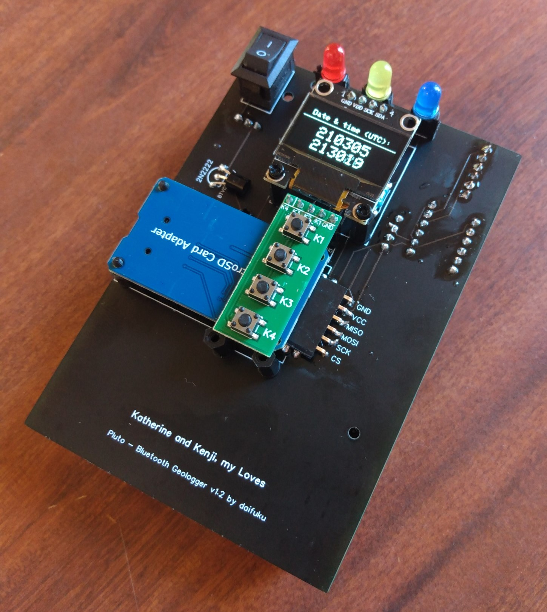

# Project Neptune: Arduino GPS w/ microSD logging and Bluetooth for Nikon D300(S)/D700
This is Project Neptune: an Arduino-based GPS data-logger for Nikon D300, D300S and D700 cameras with USB and Bluetooth connectivity.

  

## Why?
I'm an active travel photographer, and use various hardware & software-based GPS solutions to geo-tag my images on the fly, all with distinct shortcomings when paired with my ancient (but lovely) Nikon D700. So, I've built a geo-tagging GPS to meet my own specific needs. (See [Disclaimer](#Disclaimer).)

Leveraging what I've learned from an earlier attempt at a mobile GPS-solution (see [Project Pluto](https://github.com/daifukusensei/arduino-gps-logger), I've affectionately named this Project Neptune.

## Features
- Mounts to the bottom of a Nikon D300(S)/D700, and is powered directly from the camera
- Connects to a Nikon D300(S)/D700 camera via Mini-USB-to-10-pin cable for direct geo-tagging of captured images
- Bluetooth pairing with mobile phone or NMEA 0183-compatible device/DSLR (see [Specifications and Requirements](#Specifications-and-Requirements))
- Logging of co-ordinates to microSD card at 2-second intervals
- Waypoint marking upon button press
- LEDs to indicate satellite and Bluetooth fix, and microSD card activity
- Individual features (microSD logging, Bluetooth and LEDs) may be toggled on or off, with settings retained across power-cycles

## Repository Contents
- [Arduino Sketch](./nikon-d300-s-d700-gps-logger.ino) for uploading to an Arduino Nano or compatible clone
- [Gerber file](./pcb/Project-Neptune-Gerber-PCB-v22.08.001.zip) for printing a PCB
- [EasyEDA project](./pcb/Project-Neptune-EasyEDA-project.zip) for modifying the PCB schematic

## Parts List
| Quantity | Description | Note |
| --- | --- | --- |
| 1 | Arduino Nano/Every or clone w/ soldered straight male headers |  |
| 1 | u-blox NEO-6M GPS module w/ external antenna and built-in EEPROM, and soldered straight male header | Part GY-NEO6MV2:  |
| 1 | HC-05 Bluetooth module without carrier board |  |
| 1 | SPI microSD card adaptor w/ soldered straight male header | Of the following form-factor:  |
| 1 | 4-key button-board module w/ soldered straight male header | |
| 1 | 4-channel 3.3V/5V bi-directional logic-level-converter (LLC) w/ soldered straight male headers | Of the following form-factor:  |
| 1 | 2N2222 NPN transistor | For turning on and off the HC-05 Bluetooth module  |
| 1 | 2-pin SPST rocker switch | 15mm\*10mm, in the following form-factor:  |
| 1 | 3.3V/5V/12V 6-color LED board | Of the following form-factor:  |
| 1 | 5-position 2.5mm pitch female blade socket connector |  |
| 1 | Female Mini-USB connector on 2.54mm pitch breakout board | Of the following form-factor (approximately 20mm*18mm:   |
| 1 | 1/4-inch tripod screw w/ head diameter no larger than 12mm | For securing Project Neptune to the camera-- the smaller and shorter the better so as to not make contact with PCB components:   |

## Libraries and Compile Requirements
Project Neptune uses the following libraries:
- [EEPROM](https://www.arduino.cc/en/Reference/EEPROM)
- [NeoGPS](https://github.com/SlashDevin/NeoGPS)
- [SdFat](https://github.com/greiman/SdFat)
- [SoftwareSerial](https://www.arduino.cc/en/Reference/softwareSerial)
- [SPI](https://www.arduino.cc/en/reference/SPI)

I had to do the following to compile against the Arduino Nano *Every*, though these changes may no longer be required and are not needed if an older Arduino Nano is used:
- NeoGPS: remove the `class Print` forward declarations from the following files:
    - DMS.h
    - NeoTime.h
- SdFat: set `SPI_DRIVER_SELECT` to `1` in **SdFatConfig.h** per [greiman/SdFat-beta#42](https://github.com/greiman/SdFat-beta/issues/42)
- Change `#define F(str) (str)` in **Arduino.h** to `#define F(str) (const __FlashStringHelper*)(str)`

## Build Instructions

  
  

Due to the overlapping of the Arduino Nano Every and SPI microSD card adaptor on opposing sides of the PCB, I suggest building in the following sequence:
1. Upload [arduino-gps-logger.ino](./arduino-gps-logger.ino) to Arduino Nano Every
2. Print this repository's STL files; I forget settings used, but note the following:
    - Wall thickness should be adjusted to accommodate heat-set inserts
    - Supports are required only for [Project-Pluto-enclosure-bottom.stl](./STL/Project-Pluto-enclosure-bottom.stl)
    - I've applied gluestick to the printer's bed
3. Insert heat-set inserts to holes on printed [Project-Pluto-enclosure-top.stl](./STL/Project-Pluto-enclosure-top.stl)
4. [Print a PCB](https://jlcpcb.com/) from this repository's Gerber file, with the following settings:
    - 2 layers
    - 1.6mm PCB thickness
5. Solder **220Ω resistors**, **2N2222 NPN transistor** and **2-pin SPST rocker switch** in their respective footprints on the PCB
6. Solder all **straight female headers** from the [Parts List](#Parts-List) to each component's respective footprint on the PCB, except for the microSD card adaptor and HC-05 Bluetooth module
7. Solder **right-angle female headers** to the footprints of the **HC-05 Bluetooth module** and **microSD card adaptor**, slightly tilting back the latter to clear the Arduino Nano Every female header's solder joints
8. Solder **SMT AA battery holder**, ensuring correct orientation of terminals according to footprint on PCB
9. Trim legs of each LED so base rests flush with female headers
10. Plug-in and screw-down (where required) remaining components:
    - HC-05 Bluetooth module
    - u-blox NEO-6M GPS module
    - LLC
    - Pololu 5V step-up voltage regulator
    - Arduino Nano Every
    - LEDs
    - SSD1306 0.96" 128x64 I2C OLED display
    - SPI microSD card adaptor
    - 4-key button-board module
11. Recess the completed unit into the front half of the enclosure, being careful to ensure the LEDs slip properly into their respective cavities
12. Insert AA batteries
13. Screw-down enclosure with 12mm M2 screws (and washers, to avoid fracturing the enclosure)

## Operating Instructions
### Specifications and Requirements
- u-blox NEO-6M GPS and HC-05 Bluetooth modules operate at 4800 baud, for Nikon DLSR-compatibility
- Pairs with any Bluetooth Serial Port Profile (SPP) NMEA 0183-compatible device with PIN/passkey 0000
- microSD card required for logging and waypoint-marking
- When logging is enabled, co-ordinates are written to microSD card at 2-second intervals

### Startup Sequence
1. Any user-changed settings are restored from EEPROM
2. If **Waypoint-Marker** button is held, the HC-05 Bluetooth module is re-configured as follows:
	1. Baud rate set to 4800 as required for Nikon D300(S)/D700 connectivity
	2. PIN set to 0000
	3. Device name set to *Nikon-D300(S)-D700-GPS-Logger*
3. Initialize access to microSD card if one's inserted; else disable logging
4. Set baud rate of u-blox NEO-6M GPS module to 4800 as required for Nikon D300(S)/D700 connectivity
5. Set compatibility mode on u-blox NEO-6M GPS module and co-ordinate-system to 4-decimal places as required for Nikon D300(S)/D700 connectivity
6. Up-and-running

### Button Functions
| Button | Long-Press (3-seconds) |
| --- | --- |
| **Logging Button** (**K1** on button-board; **D5** on PCB) | Toggle logging to microSD card on and off |
| **Bluetooth Button** (**K2** on button-board; **D6** on PCB) | Toggle Bluetooth on and off |
| **Waypoint-Marker Button** (**K3** on button-board; **D7** on PCB) | **During normal use:** - Record current co-ordinates in file on microSD card, regardless of logging state - Requires a satellite-fix and microSD card *inserted at boot*  **During startup:** - Reset baud rate of HC-05 Bluetooth module to 4800 as required for Nikon D300(S)/D700 connectivity |
| **LED Button** (**K4** on button-board; **D8** on PCB) | Toggle LEDs on and off |

### LED Behaviour
- **GPS** (red LED on LED board)
    - Blink: No satellite-fix
    - Solid: Satellite-fix
- **Logging** (yellow LED on LED board)
    - Blink: microSD card activity
    - Solid: microSD card not inserted at boot or error writing to card
- **Bluetooth** (blue LED on LED board)
    - Blink: Searching
    - Solid: Paired
    - Off: Bluetooth is disabled
- Long-pressing a button to toggle individual settings on and off results in the respective LED being lit for 2-seconds to visually indicate a state change

### microSD Card Behaviour
- When logging is on:
  1. File **yymmdd_log_nn.txt** is created in the root of the microSD card with a header row each time logging state is changed to **ON** and a date & time is acquired from the GPS (where **yymmdd** equals current UTC date, and **nn** equals incrementing number beginning with 00)
  2. Given a satellite-fix, the following comma-delimited fields are appended to the file at 2-second intervals
     - Latitude
     - Longitude
     - Speed (km/h)
     - Heading (degrees)
     - Altitude (floating-point meters)
     - Date and Time (UTC)
- Waypoint-markers are appended to file **waypoints.txt** in the same format as above, regardless of logging state

## Disclaimer
**Build and use at your own risk.** I am not an electrical engineer, nor a working C++ developer; this is a passion-project constructed in between numerous daddy duties, household chores, and long working hours. That said, it functions as intended, and has yet to blow up.