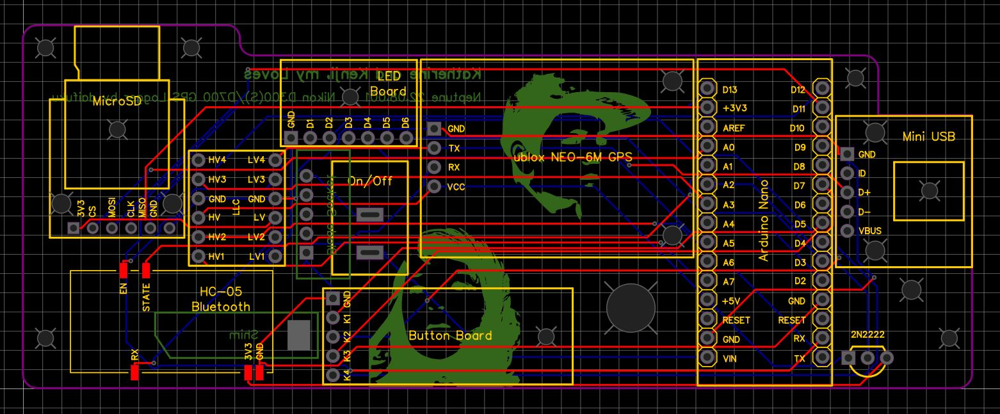
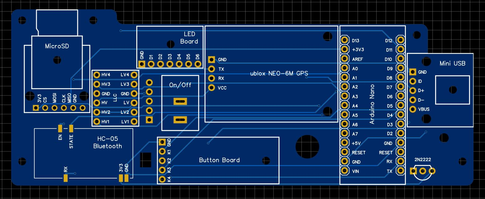
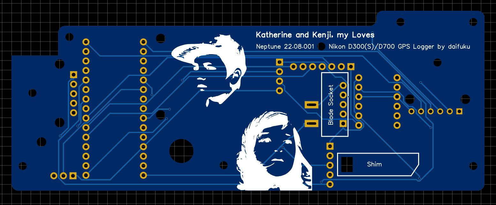

# Project Neptune: EasyEDA Project and Gerber File

- **Project-Neptune-EasyEDA-project.zip**

  

    - Zip file containing the schematic and PCB as an editable EasyEDA project
    - Unzip and manually add contents to your EasyEDA project directory

- **Project-Neptune-Gerber-PCB-v22.08.001.zip**

  
  

    - A completed PCB, ready for [printing](https://jlcpcb.com/)
    - Print with the following settings:
      - 2 layers
      - 1.6mm PCB thickness
